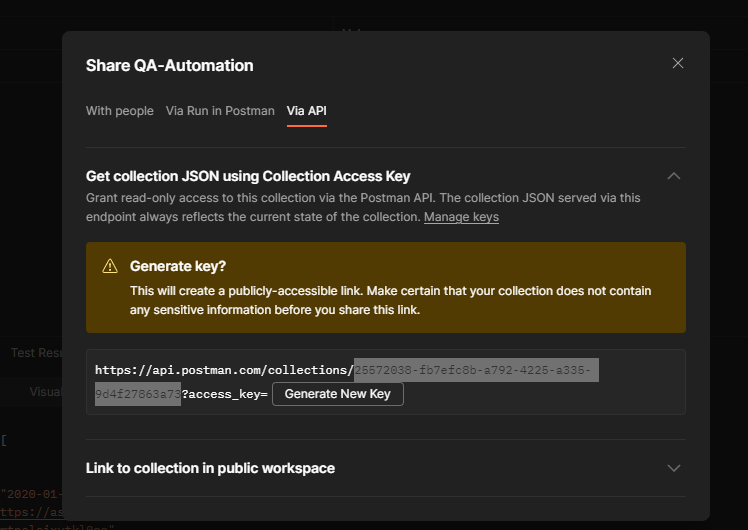

# QA-Automations
blueprints and templates for automations using github workflows

Currently it has automations for:
- api testing running postman collection
- gradle testing with selenoid

# Api Testing Using Postman and GitHub workflow
github workflow with schedule to run a postman collection with a specific postman environment.

template workflow: [api-test-postman.yml](.github/workflows/api-test-postman.yml)

The sample postman collection is "QA-Automation" under WAB "My Workspace".

Postman collection is targeting this public free API - https://api.chucknorris.io/

Each request has testing in place, so, for every response, we run the tests.


## Retrieve Postman API Key, Collection ID and Enviroment ID for GitHub secrets/vars
"api-test-postman" workflow makes use of GitHub secrets and vars to run api key and respective collection and environment IDs.
secrets and variables are here: https://github.com/brainagency/qa-automations/settings/secrets/actions

### API Key
This is a PAT.

When in need to create a new API Key, go to user settings and under API Keys we can create one:


This is stored under the GitHub repo secret "POSTMAN_API_KEY"

### Collection ID
At postman, select the collection and hit share under the context menu. Copy the ID


### Environment ID
At postman, go to environments, hit share, and copy the id


## Use GitHub Environments for api testing
Previously, we created the github enviroments under repo settings


On the settings related to actions looks this way:


Please note that the name of the variable is always the same, meaning, the workflow yml will use the exactly the same variable name, it only varies by the chosen enviroment. Also, there's no need to create repo vars because those vars will be setted by the environments.

the usage of these envs are inside the GitHub Workflow itself, as a input option:


Note: the name of these env inputs MUST have the same name as the github enviroments under repo settings.

### How to run 
Simply use the workflow dispatch input:


# GitHub Cron Expressions
use this site to test out cron expressions: https://crontab.guru/

# Slack Integration
At the github organization level, we need to add the Slack GitHub App in order to subscribe to workflow runs. 
Or, at slack in a channel, we can type "/github subscribe brainagency/qa-automations" and it will ask to install the app. 


it will open a browser tab like this:


after a couple of steps, under the repo settings, we should see this:


To configure this subscriptions we can follow this: https://github.com/integrations/slack

here are some examples of what we can do.

on each slack channel, we can run the /github command and create subscriptions.

```bash
/github subscribe brainagency/qa-automations pulls releases workflows:{name:"api-test-postman","another-workflow-name"}
```

```bash
/github subscribe brainagency/qa-automations releases
```

to list current subscriptions under the current slack channel:
```bash
/github subscribe list features
```

# Gradle

## Java version

### get the right java version
https://adoptium.net/temurin/releases/?version=8

after install, run 
```text
java -version
```
and you should see this output
```text
openjdk version "1.8.0_362"
OpenJDK Runtime Environment (Temurin)(build 1.8.0_362-b09)
OpenJDK 64-Bit Server VM (Temurin)(build 25.362-b09, mixed mode)
```

## GitHub workflow

ready to run on a schedule.

here -> [Gradle Test Workflow](/.github/workflows/gradle-test.yml)

## run locally using cli

all cmds are done at proj root level

all output is created under a folder named "build" at the proj root level

### build gradle
```bash
gradle build
```

### run selenoid server
```bash
docker compose -f docker-compose-selenoid-only.yml up
```

to open the UI navigate to -> [http://localhost:8888/](http://localhost:8888)

### run tests against selenoid server

before runnig the tests, make sure you have this image locally: 
```bash
docker pull selenoid/vnc_chrome:81.0
```

```bash
gradle web -D selenide.remote=http://host.docker.internal:4444/wd/hub 
```

### generate allure reports

#### unix
```bash
docker run --user root -v $(pwd)/build/allure-results:/app/allure-results -v $(pwd)/build/allure-report:/app/allure-report --entrypoint /app/generateAllureReport.sh frankescobar/allure-docker-service 0 default
```
#### windows
```bash
docker run --user root -v ${PWD}/build/allure-results:/app/allure-results -v ${PWD}/build/allure-report:/app/allure-report --entrypoint /app/generateAllureReport.sh frankescobar/allure-docker-service 0 default
```

## using docker compose

at proj root level

```bash
docker compose -f docker-compose.yml up
```

This one does not create allure reports due to the fact that only after the tests are done we run the generation. 

After running this docker compose, run the previous command to generate them -> [Generate Allure reports](#generate-allure-reports).

## Gradle CLI on windows

download gradle to some folder, open powershell profile and create an alias. gradle will be available under powershell.

to open powershell profile 

```bash
code $PROFILE
```

create an alias like this:

```bash
New-Alias gradle "C:\gradle\gradle-8.0.2\bin\gradle.bat"
```

